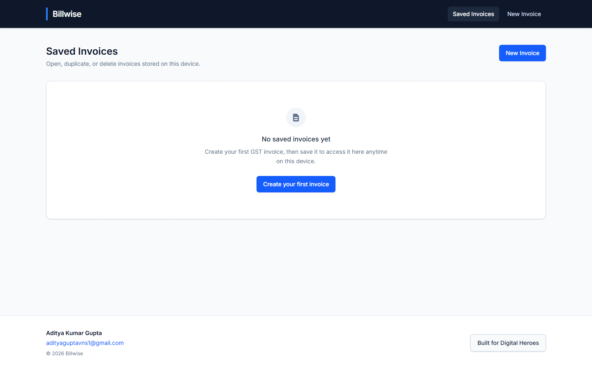
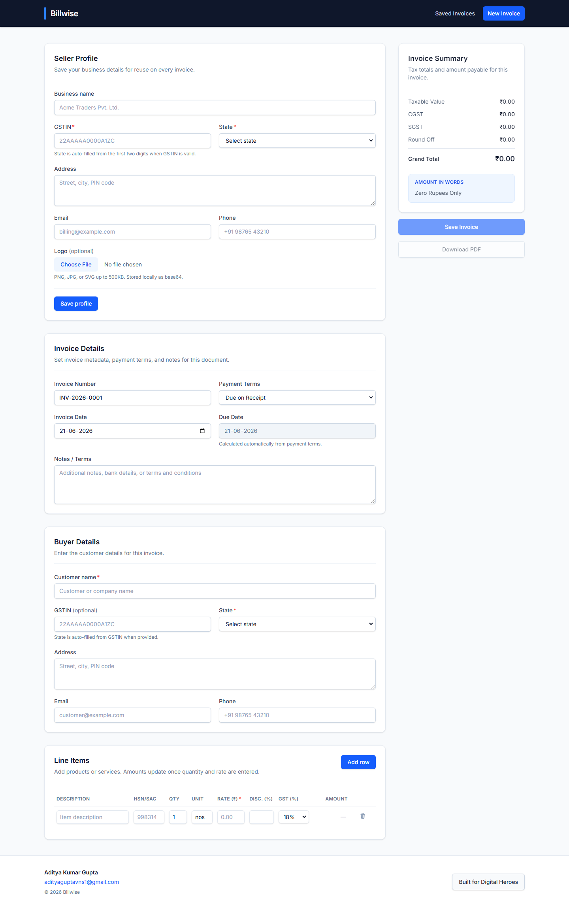

# Billwise

Billwise is a browser-based GST invoice builder for Indian businesses. Create professional tax invoices with seller and buyer details, line items, mixed GST rates, and automatic CGST/SGST or IGST calculation. Invoices are saved locally in your browser and can be exported as PDF.





## Features

- **Seller & buyer profiles** with GSTIN validation and state selection
- **Line items** with quantity, rate, discount, HSN/SAC, and mixed GST slabs (5%, 12%, 18%, etc.)
- **Automatic tax split** — CGST + SGST for intra-state, IGST for inter-state
- **PDF export** with amount in words and tax breakdown
- **Local persistence** — save, reload, duplicate, and delete invoices on this device
- **Responsive layout** — works on mobile (375px), tablet (768px), and desktop (1440px+)

## Tech stack

| Layer | Technology |
| --- | --- |
| UI | React 19, TypeScript, Tailwind CSS 4 |
| Routing | React Router 7 (hash mode) |
| Validation | Zod |
| PDF | `@react-pdf/renderer` |
| Build | Vite 8 |
| Tests | Vitest |

## Run locally

**Requirements:** Node.js 20+ and npm

```bash
# Install dependencies
npm install

# Start dev server (http://localhost:5173)
npm run dev

# Run tests
npm test

# Lint
npm run lint

# Production build
npm run build

# Preview production build (http://localhost:4173)
npm run preview
```

The preview server serves the same production build as `npm run build` — use it to verify the deployed experience matches development.

## Project structure

```
src/
  components/   # Forms, line items table, PDF document, footer
  lib/          # Tax calculator, validation, local storage, PDF download
  pages/        # Saved invoices list, invoice builder, edit page
  types/        # Invoice and seller/buyer types
```

## Author

**Aditya Kumar Gupta** — [adityaguptavns1@gmail.com](mailto:adityaguptavns1@gmail.com)

Built for [Digital Heroes](https://digitalheroesco.com).
